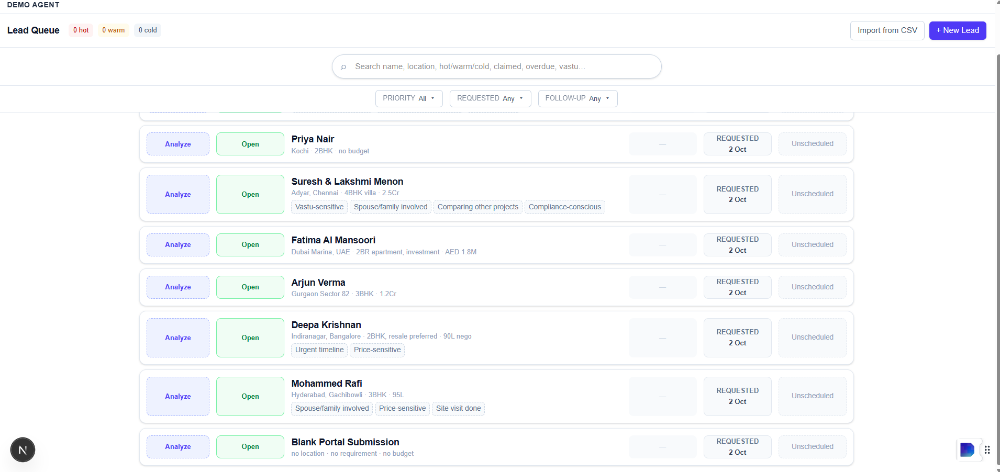
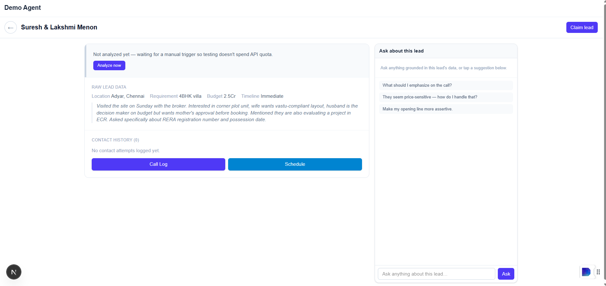

# LeadLens

LeadLens is a lead prioritization tool built for real estate sales teams. A rep pastes in a customer inquiry, however messy it is, and the app scores it, explains why, and tells the rep what to do next. It's a working prototype, every feature described here actually runs, nothing is mocked.

## The problem this solves

A sales rep handling real estate inquiries gets messages in all shapes: a one line "price?" from a portal form, a long WhatsApp forward from a broker, a detailed email after a site visit. Figuring out which of these to call first, and what to say, takes time and experience. LeadLens reads the raw message and gives the rep a shortcut: a priority score, the handful of signals that actually matter for that lead, and a suggested opening line.

## Screenshots

**Home page, the lead queue**



**Inside a lead's record**



## What it actually does

**AI analysis.** Every lead is scored hot, warm, or cold with a short reason. The AI pulls out 3 to 5 signals that most drive the decision on that specific lead (things like "spouse approval needed" or "comparing another project"), ranked by importance, not a fixed checklist. It also lists requirements, objections, and anything worth flagging, like a budget mentioned in the message that doesn't match the budget field.

**Chat on each lead.** A rep can ask a question about a specific lead and get an answer grounded in that lead's own data, not a generic chatbot reply.

**Claiming and releasing leads.** A rep claims an open lead to work it. If the lead says not interested, it goes back to the open pool so someone else can try, instead of sitting dead under one rep forever.

**Call Log and Schedule are different things.** Logging an outcome (interested, call back later, no answer, etc.) means a call actually happened. Scheduling is for a lead nobody has called yet but needs a follow-up date so it doesn't get forgotten. Scheduling never marks a lead as contacted, because it isn't.

**Search.** One search box covers name, location, hot/warm/cold, claimed/contacted/open, overdue, or any word that shows up in the AI's own analysis. No separate search modes to pick between.

**Filters.** Priority can be multi-selected (hot and warm together is a normal thing to want). There are also separate filters for when a lead was requested and when its follow-up is due, with presets like "today" and "last 7 days" plus a custom date range. One button clears everything at once.

**Backdated requests.** When logging a lead, the rep can mark it as having come in yesterday instead of today, since inquiries don't always get entered the moment they happen.

**No raw error messages.** If the AI call fails or the network drops, the rep sees a plain message, never a stack trace or an API error code.

## What was deliberately left out, and why

This is the part that matters most to read before judging the project.

**No real database.** Everything lives in the browser's local storage. There is no backend saving data anywhere. This was a conscious decision, not something that got missed. Wiring up a real database means designing a schema, building API routes, and rewriting every place the app currently talks to local storage directly into something that goes over the network instead. That's a significant rewrite of the whole data layer, not a quick add-on, and trying to squeeze it into a tight deadline risked ending up with something half-working. The local storage version works fully and was tested end to end. A real backend is the natural next step and is called out here on purpose, not quietly skipped.

**One rep, no login.** There's no authentication. Claiming a lead and tracking who claimed it are real, working mechanics, but they apply to a single hardcoded identity per browser, not a real team of logged in users.

**No way to bulk import leads yet.** Right now leads are added one at a time through a form. The app has an "Import from CSV" button that opens a panel explaining this is planned, along with what it's meant to do: mapping your spreadsheet's columns automatically, showing a preview before anything is added, and catching likely duplicates. It's there so the idea is visible, not so it looks finished.

**Free tier AI usage.** The demo leads that ship with the app are not pre-analyzed when the page loads. A rep has to click Analyze. This is intentional so that just opening or refreshing the app during a demo doesn't burn through the free Gemini quota on its own.

## Tech stack

Next.js 16 with the App Router, TypeScript, Tailwind CSS v4, and the Gemini API through the `@google/genai` package, using structured JSON output so the AI's response always comes back in a predictable shape.

## Running it yourself

```bash
npm install
cp .env.local.example .env.local
```

Open `.env.local` and put in your own Gemini API key (get one free at https://aistudio.google.com/apikey), then:

```bash
npm run dev
```

Visit http://localhost:3000.

## Known limitations

Data lives in one browser. Two reps on two different computers do not see the same list of leads, they each get their own copy.

If someone clears their browser's site data, their leads are gone. There's no backup anywhere else.

There's no automated test suite. Everything was tested by hand: adding a lead, analyzing it, claiming it, logging each kind of outcome, scheduling a follow-up, searching, filtering, and reloading the page to make sure nothing was lost.
